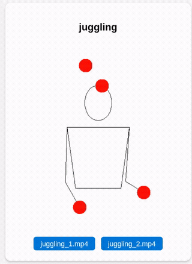

# naja

A small local web project to hand-compare videos frame-by-frame.

## building

Compile via `go build`. Ensure ffmpeg is available on your `$PATH` (for thumbnailing).

## how to use

"Similarly-named" videos (see `main.go` for criteria) are organized into cards;
buttons on these cards can switch between video versions, whilst _preserving the timestamp_.

For example, with these two Juggling Lab videos,

```
.
└── video
    ├── juggling_1.mp4
    └── juggling_2.mp4
```

after running `naja` (or `naja.exe`) in the project directory,
one can see the following card in localhost.



One can create as many cards for as many version collections as needed.

## license

GPLv3. Example art was created in Juggling Lab [1](https://jugglinglab.org/anim?pattern=(4x,4x);hands=(32,15)(10).(10)(32,15)) [2](https://jugglinglab.org/anim?pattern=(4x,4x);hands=(32,15)(10).(10)(32,15).;colors=mixed).
